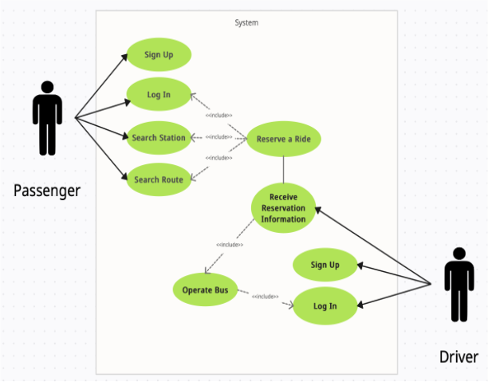

## 캡스톤 디자인
### 시스템 소개
- 인공지능 모델을 이용한 버스 도착 예정 시간 예측
- GPS의 문제점을 보완하기 위해 비콘을 이용해 사용자 위치 추정
- 무정차를 방지하기 위해 기사님에게 해당 정류장 승차 인원 정보 제공
- 버스 내 사고를 막기 위해 하차를 예약하고 이를 기사님에게 정보 제공

----
### 추가 문서

- [기능명세서](https://courageous-asteroid-4e0.notion.site/117b6db294bc81a593edf6b034e399d5?pvs=4)

- [API명세서](https://www.notion.so/API-5be59c05eb2b4488b6d5a6f03c53e4d8](https://courageous-asteroid-4e0.notion.site/API-117b6db294bc81f3a162cf701fd3ae92?pvs=4))

-----
### 나의 역할
- Spring Security를 이용해 로그인 기능 구현
- 공공데이터 API를 이용해 필요한 데이터 추출
- 이 데이터를 인공지능 서버로 넘겨주고 예정 시간 예측 데이터를 받아와서 프론트에 전달
- 공공데이터에서 받은 데이터 가공
- 백엔드 비즈니스 로직 구현
- DB 설계 및 데이터 관리
- FCM을 이용해 버스 기사 애플리케이션에 알람 보내기
-----
### 아키텍처
- UML 다이어그램

- Data Flow Chart

|회원가입|로그인|
|:---:|:---:|
|||
|승차예약|하차예약|
|||
|버스 정보 조회|예약 취소|
|||
|운행 등록|정류장 정보 알림|
|||
----
### 승객 애플리케이션
- 계정 생성 및 로그인

|||||
|:---:|:---:|:---:|:---:|
|Loading화면|FirstView|SignupView|LoginView|

- 노선 검색 기능

||||
|:---:|:---:|:---:|
|MainView|노선 검색 (search bar)|노선 검색 시 View|

- 승차 예약 기능

|||||
|:---:|:---:|:---:|:---:|
|Beacon인식|정류장 정보|승차 예약 Alert(1)|승차 예약 Alert(2)|

- 예약 현황 조회 및 하차 예약 기능

||||
|:---:|:---:|:---:|
|예약 현황View| 하차 예약 Alert(1)| 하차 예약 Alert(2)|

----
### 기사 애플리케이션
- 계정 생성 및 로그인

||||
|:---:|:---:|:---:|
|FirstView|SignupView|LoginView|

- 버스 정보 입력 및 다음 정류장 정보 획득

||||
|:---:|:---:|:---:|
|FirstView|SignupView|LoginView|
